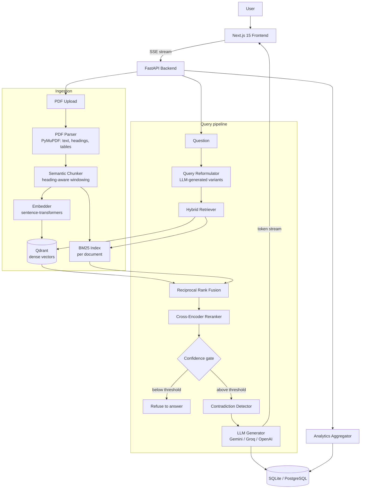

# Aegis RAG

A production-shaped Retrieval-Augmented Generation system for question-answering over your own PDF documents — hybrid dense + sparse retrieval, cross-encoder reranking, confidence-gated grounded generation, citation-level source tracing with in-PDF highlighting, and a built-in observability dashboard.

Built to demonstrate real system design for document intelligence, not a single-file LLM wrapper: separate ingestion, retrieval, generation, and evaluation layers; async I/O throughout; a self-healing local dev database path alongside proper Alembic migrations for production.

## Architecture



## What it actually does

**Ingestion**
- Parses PDFs with PyMuPDF: raw text per page, font-size-based heading detection, table extraction to Markdown.
- Chunks semantically — splits by detected heading boundaries, merges undersized sections, then windows long sections with overlap so no chunk loses context at its edges.
- Embeds every chunk with a local sentence-transformers model (no API key required) and upserts into Qdrant; builds a per-document BM25 index in parallel.
- Runs as a FastAPI background task so the upload request returns immediately — status progresses `queued → processing → ready` and the frontend polls it live.
- Flags a document as stale relative to its detected effective/revision date.

**Retrieval**
- Every question is expanded into alternate phrasings by the LLM (query reformulation), and each variant is retrieved independently.
- Dense (Qdrant cosine similarity) and sparse (BM25 keyword) results are fused with Reciprocal Rank Fusion, then re-scored by a cross-encoder for a second, more precise pass.
- Cross-encoder logits are squashed through a sigmoid so the resulting confidence score is a meaningful 0–100%, not a raw unbounded logit.
- If confidence falls under a configurable threshold, the system refuses to answer rather than hallucinate — the UI shows the refusal plus whatever was retrieved, so you can see *why* it wasn't confident.

**Generation**
- Strict grounding prompt: answer only from retrieved context, cite `[Document, Page]` inline, or say explicitly that the documents don't contain the answer.
- Streams tokens over Server-Sent Events; the frontend renders markdown as it arrives.
- When multiple documents are selected, an LLM pass checks the retrieved excerpts against each other for direct contradictions and surfaces a banner if found.
- Cross-document freshness comparison: if you've selected several versions of a policy, the newest is used as the baseline and older ones get a dated staleness warning.

**Traceability**
- Every retrieved source links back to the exact PDF page. Clicking a citation opens the actual page rendered client-side (`react-pdf`) with the cited passage highlighted, computed server-side via a PDF text search against the source excerpt.
- Every answer can be rated (👍/👎), persisted per message.
- Every query captures retrieval latency, generation latency, and token usage, surfaced on a dedicated `/analytics` dashboard: totals, rolling confidence/latency trend charts, contradiction counts, feedback tally, and a recent-answers table.

**Conversation**
- Sessions persist to the database and are listed in a history panel — resume any past conversation, including its sources, confidence, and feedback state.

## Tech stack

| Layer | Technology | Why |
| --- | --- | --- |
| Backend framework | FastAPI + Uvicorn | Async request handling, SSE streaming, automatic OpenAPI docs |
| Database | SQLAlchemy 2.0 (async) — SQLite for local dev, PostgreSQL in production | One ORM layer, two engines; a startup routine self-heals missing columns on SQLite while Alembic drives the Postgres path |
| Vector store | Qdrant | Filterable dense search with production/local parity |
| Sparse retrieval | rank-bm25 | Catches exact identifiers and terms embeddings miss |
| Embeddings | sentence-transformers (`BAAI/bge-small-en-v1.5`) | Real semantic vectors with zero API cost, fast enough on CPU |
| Reranking | `cross-encoder/ms-marco-MiniLM-L-6-v2` | Second-pass precision after fusion |
| LLM generation | Google Gemini (default), with Groq and OpenAI-compatible providers behind the same interface | Swappable at the config layer, no code changes to switch |
| PDF parsing | PyMuPDF (fitz) | Text, font metrics for heading detection, table extraction, and text search for citation highlighting, all from one library |
| Background jobs | FastAPI `BackgroundTasks` (Celery/Redis wired for the containerized path) | No broker required for local development |
| Frontend framework | Next.js 15 (App Router) + React 18 | Server/client component split, streaming, file-based routing |
| Styling | Tailwind CSS v4 | CSS-variable-driven theme with a real dark/light system, no separate design-token build step |
| PDF rendering | react-pdf / pdf.js | Client-side page rendering for the citation preview |
| Data fetching | SWR | Polling for document status, sessions, and analytics without hand-rolled state machines |
| Rate limiting | slowapi | Per-IP limits on the chat endpoint |
| Evaluation | RAGAS (faithfulness / relevance / context precision), best-effort | Wired end-to-end; degrades gracefully rather than blocking the request when the dependency chain isn't available |

## Getting started

### Requirements
- Python 3.11+
- Node.js 20+
- A Google AI Studio API key (free tier) for generation — or a Groq/OpenAI-compatible key if you prefer a different provider

### Backend

```bash
cd backend
python -m venv .venv
.venv\Scripts\activate        # Windows
# source .venv/bin/activate    # macOS/Linux
pip install -r requirements.txt

cp .env.example .env
# edit .env: set GOOGLE_API_KEY (or switch LLM_PROVIDER to groq/openai)

python -m uvicorn app.main:app --host 127.0.0.1 --port 8010
```

The first run downloads the embedding and reranker models (a few hundred MB total) — subsequent starts are fast. SQLite is the default database and needs no setup; the schema is created and self-migrated automatically on startup.

### Frontend

```bash
cd frontend
npm install
npm run dev -- -p 3010
```

Open:
- App — http://localhost:3010
- API docs (Swagger) — http://localhost:8010/docs
- Analytics dashboard — http://localhost:3010/analytics

### Docker (production-shaped path)

```bash
cp backend/.env.example backend/.env
docker compose up --build
```

This spins up PostgreSQL, Redis, Qdrant, the Celery worker, and the FastAPI backend together, with Alembic migrations running automatically. Run the frontend separately with `npm run dev` pointed at the containerized API.

## Configuration

All configuration lives in `backend/app/config.py`, populated from `backend/.env`.

| Variable | Default | Purpose |
| --- | --- | --- |
| `LLM_PROVIDER` | `gemini` | `gemini`, `groq`, or `openai` |
| `GOOGLE_API_KEY` / `GEMINI_MODEL` | — / `gemini-2.5-flash` | Gemini generation |
| `GROQ_API_KEY` / `GROQ_MODEL` | — | Groq generation |
| `OPENAI_API_KEY` / `OPENAI_BASE_URL` / `OPENAI_CHAT_MODEL` | — | OpenAI-compatible generation (also works with proxy providers) |
| `USE_LOCAL_EMBEDDINGS` / `LOCAL_EMBEDDING_MODEL` | `true` / `BAAI/bge-small-en-v1.5` | Local vs. API embeddings |
| `RERANKER_MODEL` | `cross-encoder/ms-marco-MiniLM-L-6-v2` | Second-pass reranking |
| `CONFIDENCE_THRESHOLD` | `0.2` | Minimum post-rerank confidence to generate an answer |
| `RETRIEVAL_TOP_K` | `5` | Chunks passed to the generator |
| `STALE_AFTER_DAYS` | `365` | Days behind the newest selected document before a freshness warning fires |
| `DATABASE_URL` | `sqlite+aiosqlite:///./data/rag.db` | Swap for a `postgresql+asyncpg://...` URL in production |
| `CHAT_RATE_LIMIT` | `20/hour` | Per-IP limit on `/api/chat/stream` |

## API surface

| Method | Path | Purpose |
| --- | --- | --- |
| `POST` | `/api/documents` | Upload a PDF; ingestion runs in the background |
| `GET` | `/api/documents` | List documents with status/metadata |
| `GET` / `DELETE` | `/api/documents/{id}` | Fetch or remove a document |
| `GET` | `/api/documents/{id}/file` | Stream the original PDF |
| `GET` | `/api/documents/{id}/pages/{n}/highlight?text=` | Bounding boxes for a passage on a page |
| `POST` | `/api/chat/stream` | Ask a question against selected documents (SSE) |
| `PATCH` | `/api/chat/messages/{id}/feedback` | Record 👍/👎 on an answer |
| `GET` | `/api/chat/sessions` | List conversation history |
| `GET` / `DELETE` | `/api/chat/sessions/{id}` | Load or delete a conversation |
| `GET` | `/api/analytics/overview` | Aggregate stats, trend timeline, recent answers |
| `GET` | `/api/health` | Liveness check |

Full interactive documentation is auto-generated at `/docs`.

## Repository layout

```text
backend/
  app/api/            FastAPI routers — documents, chat, analytics, evaluation, health
  app/core/           ingestion, chunking, embedding, retrieval, generation, contradiction/freshness logic
  app/db/             SQLAlchemy models, async session management, Alembic migrations
  app/evaluation/     RAGAS integration
  app/tasks/          background ingestion job
  app/utils/          PDF parsing, table extraction, logging, rate limiting
frontend/
  app/                Next.js routes — chat, analytics dashboard, API proxy
  components/         chat UI, document sidebar, PDF preview modal, charts, status indicators
  lib/                typed API client and SWR hooks
```

## Known limitations

- Single-tenant by design — there's no auth layer; every request is scoped to one demo user. Swapping in real user isolation only touches the `user_id` field on documents and sessions.
- Citation highlighting locates a passage by searching the PDF's text layer for a shortened prefix of the cited excerpt; it can miss on PDFs with unusual text encoding or heavy hyphenation.
- OCR for scanned (image-only) PDFs is detected but not yet run — such pages currently yield near-empty text rather than a recognized transcript.
- RAGAS evaluation is wired end-to-end but depends on a fast-moving upstream package; when the dependency chain is unavailable it degrades to a no-op rather than blocking chat, so the evaluation table may show zeros until that's pinned.
